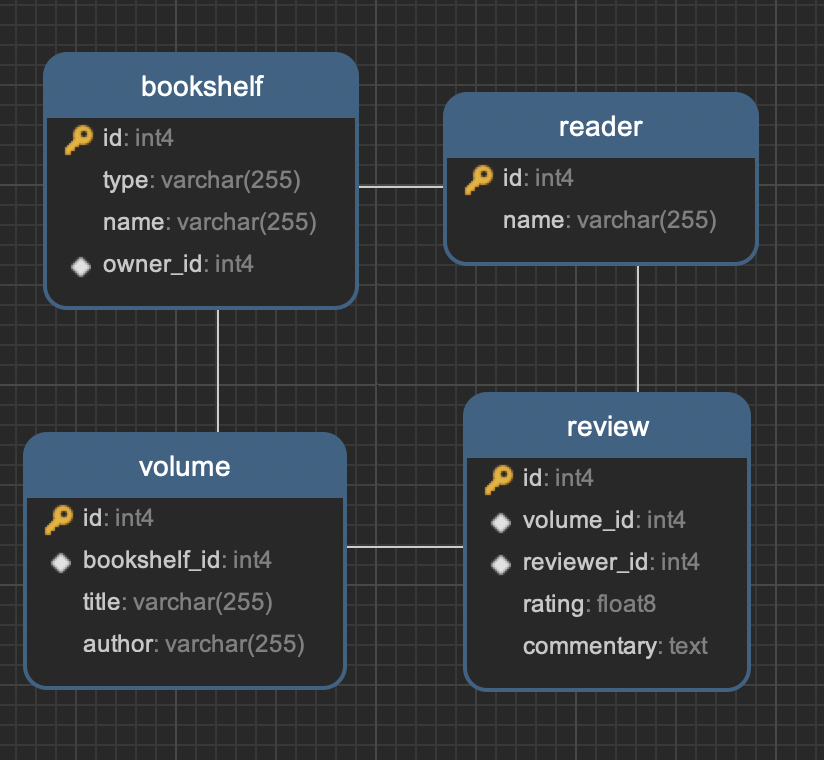

## Bookshelf 📚🐹

A place to store data about my personal bookshelf (and learn PHP + Symfony :D)

### Requirements

PHP >= 8.2

Symfony CLI >= 5.7.5

### Usage

- Start the application

```bash
docker-compose up -d
```

- Migrate the database

```bash
symfony console doctrine:migrations:migrate
```

### Entity Relationship Diagram


